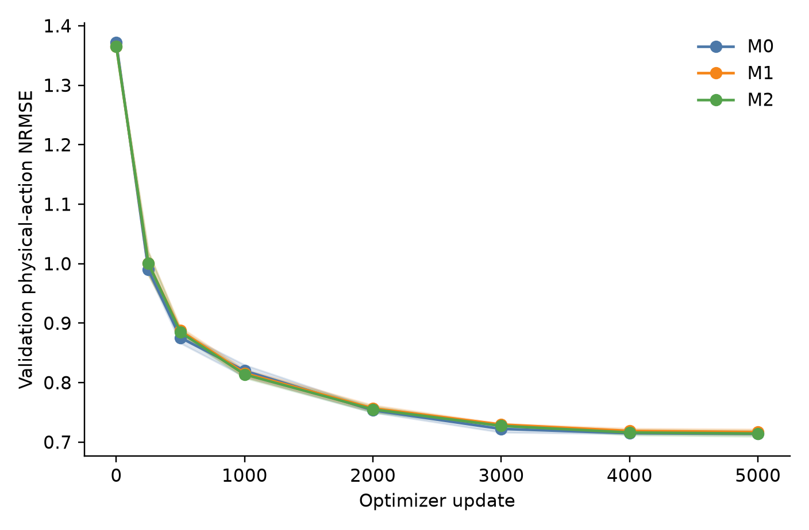
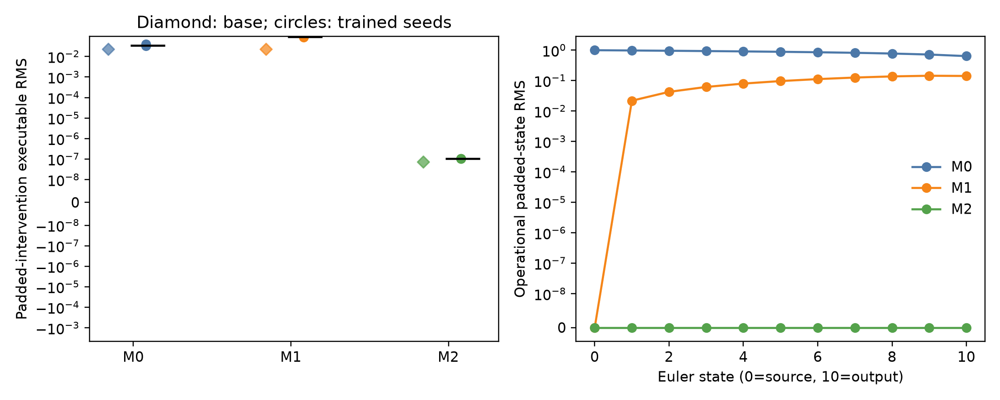
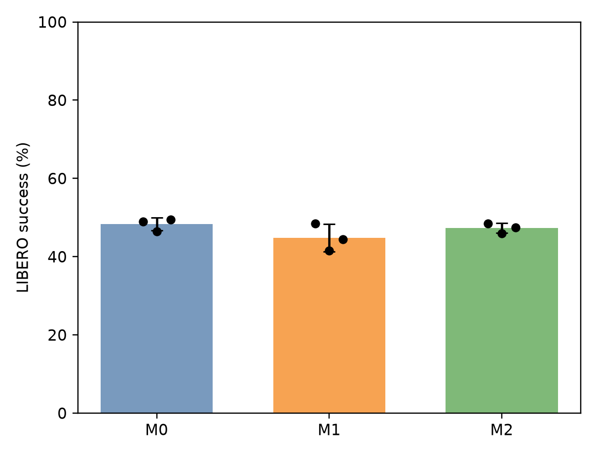

# FlowSpec-VLA

**Action-interface consistent post-training for flow-matching vision-language-action models**

FlowSpec-VLA asks whether SmolVLA's 25 non-executable, padded action coordinates interfere with learning the seven actions that LIBERO actually executes. A frozen diagnostic found measurable coupling. We then compared three controlled interventions using the same base model, data split, training budget, and evaluation protocol.

**Result:** projecting the flow state onto the executable action subspace removes the measured leakage, but does **not** improve physical-action validation error or LIBERO rollout success. This is a completed, negative practical result, not a VLA performance improvement claim.

## Experiment at a glance

| Method | Padded source noise | Padded state during inference | Final physical NRMSE ↓ | Trained leakage ratio ↓ | LIBERO success ↑ |
| --- | --- | --- | ---: | ---: | ---: |
| M0 · standard flow matching | Gaussian | Evolves | **0.71379** | 0.015760 | **290/600 (48.33%)** |
| M1 · source masked | Zero | Evolves | 0.71696 | 0.103029 | 269/600 (44.83%) |
| M2 · full subspace | Zero | Projected to zero each step | 0.71439 | **1.40 × 10⁻¹³** | 284/600 (47.33%) |

Each method used three matched training seeds and 5,000 updates per seed. The comparison covers all 40 tasks in four LIBERO suites: 320 training episodes, 200 held-out episodes, 400 frozen validation states, and 1,800 rollout episodes in total. The final checkpoint was fixed in advance. M2 is only 0.358% better than M1 on mean final NRMSE; neither intervention beats M0 on mean validation error or rollout success. The separate Gate-0 diagnostic found a leakage ratio of 0.05729682371 on its frozen task-checkpoint states; it did not by itself establish task-level harm.

## Why the rerun matters

The first Phase-1 attempt failed its preregistered M1/M2 reproducibility check and is **historical invalid evidence**. A forensic audit localized fresh-run divergence to CUDA backward gradients under the original execution settings. Deterministic execution and a complete training-state checkpoint then passed a fresh-process resume gate: the continuation's batches, stochastic inputs, gradients, model tensors, and optimizer tensors matched exactly. Only the subsequent clean nine-run rerun supports the table above.

The three methods share executable action targets, normalization, model architecture, optimizer, examples, and update budget. Official SmolVLA training evaluates one sampled flow time, so M1 and M2 have identical training computations and bitwise identical final model tensors for corresponding seeds. M2's additional projection acts during iterative inference. No additional loss or model architecture was introduced.

## Read the evidence

- [Final clean-rerun report](PHASE1_RERUN_REPORT.md): protocol, per-seed metrics, learning curves, leakage audit, rollouts, and limitations.
- [Frozen clean-rerun protocol](PHASE1_RERUN_PROTOCOL.md) and [experiment state](EXPERIMENT_STATE.md): preregistration and completion status.
- [Technical review bundle](TECHNICAL_REPORT_REVIEW_BUNDLE.md): a map of the code path, exact revisions, evidence, and interpretation issues.
- [Forensic report](FORENSIC_REPORT.md) and [resume-gate report](RESUME_GATE_REPORT.md): why the initial run was invalid and how deterministic continuation was established.
- [Gate-0 report](GATE0_REPORT.md) and [historical invalid Phase-1 report](PHASE1_REPORT.md): mechanism discovery and quarantined history.
- [Phase-1 implementation](src/flowspec_vla/phase1.py): the M0/M1/M2 flow intervention and physical-space metric implementation.

The [recovery/final-2026 branch](https://github.com/haoranli623/Flowspec/tree/recovery/final-2026) preserves structured results, rollout episode records, SHA-256 manifests, reconstruction instructions, and an analysis-only replay script. Its Recovery Assets Release holds the six unique final inference weight files and the raw numerical archive. From a clone, the recovery/verify_archive.sh script checks the archived evidence and replays aggregate results without the simulator or model weights. Full GPU reproduction requires the pinned upstream model, dataset, software environment, and simulator described in that branch's recovery/RECOVERY.md.

## Interpretation notes

The project records its final verdict as **P2 — mechanism confirmed, practical benefit weak**. A literal reading of the original frozen decision tree appears to assign **P5** because neither intervention improves downstream performance; the evidence-level conclusion is the same. The rerun protocol also displays an NRMSE formula that differs from the original protocol and the implemented per-coordinate training-standard-deviation normalization used for all reported numbers. Both documentation issues are disclosed in the [technical review bundle](TECHNICAL_REPORT_REVIEW_BUNDLE.md); neither changes the numerical results.

The findings apply to the tested SmolVLA base, LIBERO tasks, data budget, and frozen evaluation. They do not establish a general result for other VLA models or benchmarks.
